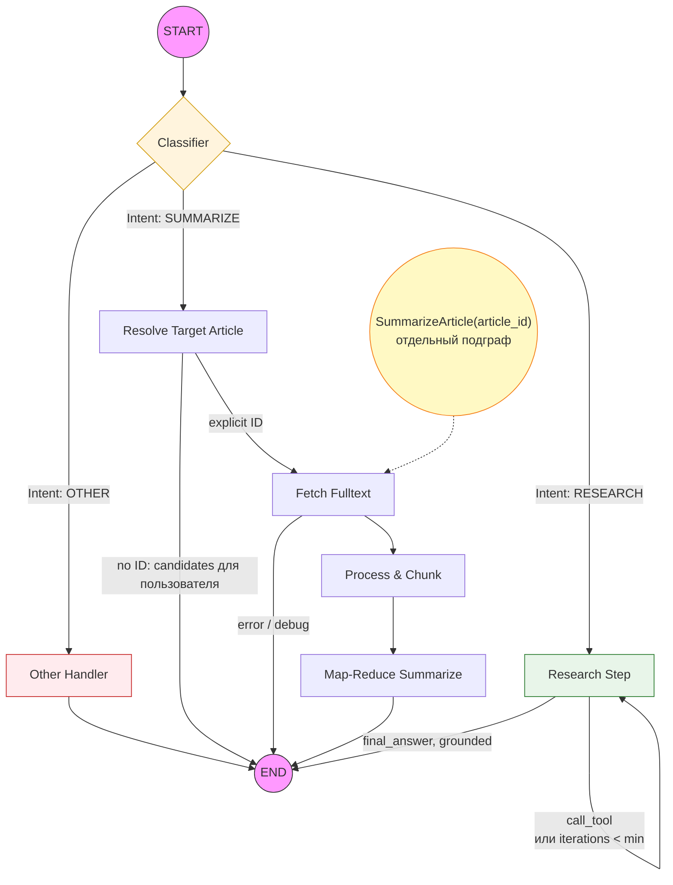
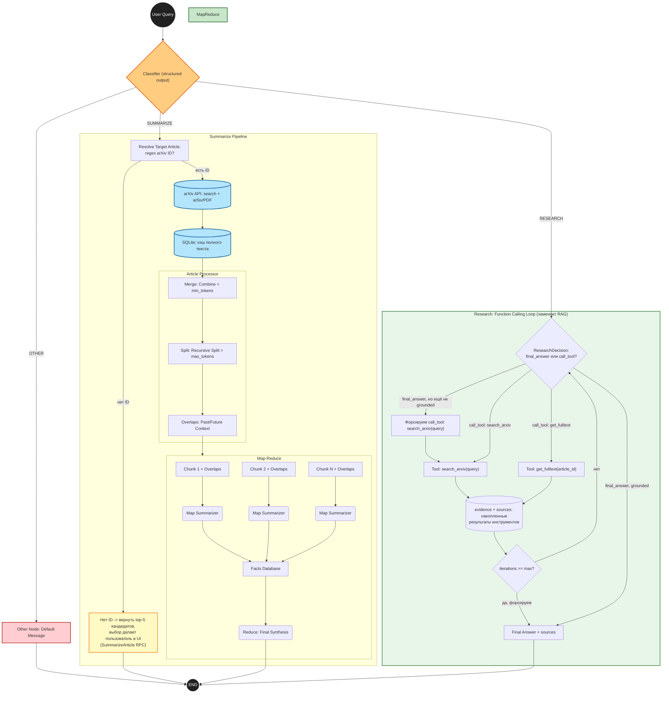

# ArXiv Research Agent


LLM-агент для работы с научной литературой arXiv: структурированные обзоры статей целиком и ответы на исследовательские вопросы с опорой на реально найденные публикации. Локальный инференс на Apple Silicon, потоковая выдача, gRPC-бэкенд и Streamlit-клиент.

**Что делает:**

* **Обзор статьи целиком** — не пересказ аннотации, а Map-Reduce по полному тексту (ar5iv/PDF) со структурированным аналитическим отчётом на русском языке.
* **Ответ на исследовательский вопрос** — агентный цикл с function calling: модель сама решает, что искать и что читать, ответ сопровождается списком источников.
* **Русскоязычные запросы** — LLM-rewriter переводит запрос в field-scoped булев запрос arXiv API, без которого лексический поиск по кириллице не находит ничего.
* **Потоковая выдача** — прогресс по стадиям с оценкой оставшегося времени, промежуточные выжимки по разделам и посимвольная генерация итогового отчёта.

---

## Быстрый старт

```bash
# 1. Зависимости
pip install -r requirements.txt

# 2. Конфигурация (опционально — у всех параметров есть рабочие дефолты)
cp .env.example .env   # либо создайте .env вручную, см. «Конфигурация»

# 3. Бэкенд: поднимает агента и модель один раз, слушает localhost:50051
python -m grpc_service.server

# 4. UI в отдельном терминале
streamlit run ui/streamlit_app.py
```

Модель по умолчанию (`Qwen3-4B-Instruct-2507-4bit`, ~2.5 ГБ) скачивается автоматически при первом запуске.

**Программное использование:**

```python
from modules.bootstrap import build_agent
from modules.config import AppConfig

agent = build_agent(AppConfig.from_env())

# Явный ID или ссылка — суммаризация сразу, без поиска
result = agent.invoke("Сделай детальный обзор статьи 1706.03762")
print(result["final_answer"])

# Без явного ID — вернутся кандидаты, статью выбирает пользователь
result = agent.invoke("Сделай обзор статьи про diffusion models")
result = agent.summarize_article(result["candidates"][0]["arxiv_id"])

# Research-ветка — с гарантированным обращением к arXiv
result = agent.invoke("Что известно про dropout как метод регуляризации?")
print(result["final_answer"], result["sources"])

# Потоковый вариант: ProgressEvent / ChunkDoneEvent / TextDeltaEvent / FinalEvent
for event in agent.summarize_article_stream("1706.03762"):
    ...
```

---

## Задача

**Аудитория.** Исследователи, аспиранты, ML-инженеры, отслеживающие поток arXiv (~20 тыс. статей в месяц).

**Проблема.** Аннотации недостаточно, чтобы решить, нужна ли статья — требуется вычитывать методику и результаты. Поиск arXiv лексический и практически англоязычный: он не понимает вопрос на естественном языке, тем более на русском.

**Результат.** Путь «вопрос → обоснованный ответ со ссылками» сокращается с часов до минут.

**Границы применимости.** Система не заменяет чтение статьи для глубокой работы, не строит векторный индекс arXiv, не выполняет систематический обзор или мета-анализ и не оценивает научную новизну.

---

## Архитектура

Поток управления — граф состояний на **LangGraph**.



**Intent Classifier** (structured output) разводит запрос на три ветки: `summarize`, `research`, `other`.

**Summarize-ветка.** `resolve_target_article` извлекает явный arXiv ID или ссылку и сразу переходит к загрузке; если ID нет, узел **не угадывает статью сам**, а возвращает top-N кандидатов — выбор делает пользователь через отдельный RPC `SummarizeArticle`. Далее `fetch_fulltext` (ar5iv/PDF с SQLite-кэшем) → `process_and_chunk` (Merge & Split) → `map_reduce_summarize`.

**Research-ветка** (function calling вместо RAG). Цикл `research_step`, ограниченный `max_research_iterations`. На каждом шаге модель через structured output решает: ответить сейчас или вызвать инструмент — `search_arxiv` либо `get_fulltext`. Результат попадает в накопленный контекст (`evidence`), цикл повторяется до достаточности данных или до лимита итераций. Использованные статьи попадают в `sources`.

<details>
<summary><b>Детальный граф обработки</b></summary>



</details>

---

## Ключевые технические решения

### Полнотекстовый слой поверх живого arXiv

`modules.arxiv_source` + `modules.article_store` работают напрямую с arXiv, без промежуточной БД.

* **Разбор идентификаторов** (`arxiv_source.identifiers`) — единая точка распознавания: новый формат (`2301.12345`), старый формат до апреля 2007 (`math/0702019`, `hep-th/9901001` — по whitelist известных архивов, а не по любому `слово/цифры`), URL (`arxiv.org/abs|pdf/…`, `ar5iv/html/…`), DOI (`10.48550/arXiv…`). Старый формат требует отдельной обработки на всём пути: наивное `raw_id.rsplit("/", 1)[-1]` при разборе Atom-фида теряет префикс архива и превращает `math/0702019v1` в нерезолвимый `0702019v1`.
* **Прямая ссылка или ID — без поиска.** `ArxivToolkit.find_candidates()` — общая точка входа для summarize-ветки и инструмента `search_arxiv`: если запрос сам является идентификатором, выполняется `get_by_id`, поиск и LLM-rewriter не задействуются.
* **Query Rewriter** (`modules.query_rewriter`) — для остальных запросов LLM извлекает структурированный `SearchPlan` (английские термины, устойчивые фразы, авторы, категории, годы), из которого детерминированно строится лестница field-scoped булевых запросов (`ti:`/`abs:`/`all:`/`au:`/`cat:`/`submittedDate:`) убывающей специфичности; используется первый уровень с непустым результатом. Планы кэшируются в SQLite. На запросе «что такое механизм внимания в трансформерах?» без rewriter'а релевантны 0 из 5 результатов, с rewriter'ом — 5 из 5.
* **Соблюдение лимитов API** — один `RateLimiter` (`arxiv_source.rate_limit`) на ВСЕ обращения к arXiv (поиск, ar5iv, PDF): не чаще одного запроса в 3 секунды суммарно, а не по каждому классу запросов отдельно. Раздельный троттлинг не спасал — поиск и полнотекст вызываются подряд на промахе кэша (`SqliteArxivArticleStore._fetch_and_cache`), и несогласованный всплеск запросов к разным хостам одной и той же инфраструктуры рано или поздно приводил к тому, что arXiv переставал отвечать вовсе. Повтор при 429 (с уважением `Retry-After`) и таймаутах, экспоненциальный backoff с джиттером, без повтора собственных 4xx. Результаты поиска кэшируются (SQLite, TTL 6 ч.) — лестница query rewriter'а (до 6 запросов на один поиск) не платит за повтор одного и того же запроса дважды.
* **Полный текст**: сначала [ar5iv](https://ar5iv.labs.arxiv.org) (LaTeXML-рендер с размеченными `<h2>/<h3>` секциями), при неудаче — PDF через PyMuPDF с regex-эвристикой заголовков. Результат кэшируется в SQLite.

### Двухстадийный Article Processor (Merge & Split)

Подготовка длинной статьи под ограниченное контекстное окно с сохранением структуры:

1. **Token-Aware Merging** — мелкие подразделы объединяются с соседями до порога `min_tokens`, что сокращает число вызовов LLM.
2. **Recursive Splitting** — секции сверх `max_tokens` рекурсивно разбиваются с сохранением нумерации в заголовках (*"Methodology (Part 1)"*).
3. **Custom Overlaps** — каждый чанк получает «теневой» контекст соседей (`past_overlap`, `future_overlap`) для связности выжимок.

### Map-Reduce с разделением ролей

Map и Reduce решают принципиально разные задачи, и промпты разведены соответственно: **Map сжимает** каждый чанк в короткий абзац (до 800 символов, без списков) с самым существенным — ключевым результатом, цифрами, формулами в LaTeX; **Reduce синтезирует** из этих абзацев аналитический отчёт по фиксированной содержательной структуре — цель, методология, результаты, значимость. Промежуточные выжимки передаются в Reduce без markdown-заголовков: разметка, повторяющая структуру источника, провоцирует модель воспроизвести её на выходе, превращая отчёт в конкатенацию фрагментов вместо синтеза.

### Провайдер-агностичный function calling

Нативные tool-calling API несовместимы между провайдерами (OpenAI-совместимый `tools=` у OpenRouter, отсутствие единого стандарта у локального MLX), поэтому structured output реализован независимо от бэкенда: `modules.structured_output.generate_structured()` накладывает JSON-инструкцию поверх произвольного промпта, валидирует ответ Pydantic-схемой, при невалидном JSON выполняет один repair-запрос и при повторной неудаче возвращает безопасный дефолт с логированием. Модель выбирает `action: final_answer | call_tool`, диспетчеризацию выполняет Python.

Граничные случаи агентного цикла обработаны явно, поскольку компактные модели попадают в них регулярно:

* **Grounding-гарантия** — до выполнения `min_research_iterations` вызовов инструмента финальный ответ подменяется на `call_tool`: без этого модель способна ответить, ни разу не обратившись к arXiv.
* `call_tool` без имени инструмента или с пустыми аргументами нормализуется в `search_arxiv(query=запрос пользователя)`.
* При исчерпании лимита итераций агент выполняет дополнительный вызов с явно снятыми инструментами и требованием сформулировать ответ по собранным данным — вместо отдачи заглушки при непустом `evidence`.

### Потоковая выдача

`Ask` и `SummarizeArticle` — server-streaming RPC, отдающие поток `AskEvent` (`progress` / `map_summary` / `delta` / `final`). Агент исполняет узлы напрямую (`invoke_stream`, `summarize_article_stream`), что даёт видимость не только на границах узлов, но и внутри `map_reduce_summarize` — самого долгого из них. UI получает:

* прогресс по стадиям с процентом и ETA, экстраполированной по фактическому темпу обработки чанков;
* промежуточные выжимки по разделам — по мере готовности каждой;
* посимвольную генерацию итогового отчёта на стадии Reduce.

Токенный стриминг реализован на уровне провайдеров (`generate_stream`); для structured-output узлов он намеренно не применяется — там требуется целиком валидный JSON.

---

## Конфигурация

Все параметры имеют рабочие дефолты (`modules/config.py`); переопределяются через `.env`.

| Переменная | Дефолт | Назначение |
|---|---|---|
| `APP_LLM_BACKEND` | `mlx` | `mlx` (локально) или `openrouter` (облако) |
| `APP_MLX_MODEL` | `mlx-community/Qwen3-4B-Instruct-2507-4bit` | Локальная модель |
| `APP_OPENROUTER_MODEL` | `qwen/qwen3-30b-a3b-instruct-2507` | Облачная модель |
| `OPENROUTER_API_KEY` | — | Обязателен при `APP_LLM_BACKEND=openrouter` |
| `APP_OPENROUTER_MAX_CONCURRENCY` | `8` | Одновременных HTTP-запросов к OpenRouter в одном батче (map-стадия и т.п.) |
| `APP_MIN_RESEARCH_ITERATIONS` | `1` | Минимум вызовов инструмента до финального ответа |
| `APP_MAX_RESEARCH_ITERATIONS` | `3` | Лимит итераций research-цикла |
| `APP_ARXIV_MAX_CANDIDATES` | `5` | Сколько статей предлагать на выбор |
| `APP_ARXIV_MIN_REQUEST_INTERVAL_SEC` | `3.0` | Минимальный интервал между запросами к arXiv (общий на поиск+ar5iv+PDF) |
| `APP_CACHE_DB_PATH` | `data/arxiv_cache.sqlite` | Кэш полных текстов |
| `APP_SUMMARIZATION_LOG_DIR` | `logs/summarizations` | Лог суммаризаций; пустая строка отключает |
| `APP_GRPC_HOST` / `APP_GRPC_PORT` | `localhost` / `50051` | Адрес бэкенда |
| `APP_USE_HUB` | `false` | Тянуть промпты из LangSmith Hub |
| `LANGSMITH_API_KEY` | — | Трассировка и Hub (опционально) |

**Выбор модели.** Дефолтная `Qwen3-4B-Instruct-2507-4bit` (~2.5 ГБ) рассчитана на комфортную работу при 16–24 ГБ unified memory. Более крупная `Qwen3-30B-A3B-Instruct-2507-4bit` (~15–17 ГБ) заметно сильнее, но на 24 ГБ под обычной десктопной нагрузкой уводит систему в своп, растягивая суммаризацию с секунд до 5–7 минут.

> **Время ответа.** Суммаризация статьи целиком — Map-Reduce по нескольким десяткам чанков, вызовы к MLX идут последовательно без батчинга: на локальной модели это минуты (таймауты клиента — 900 с). Research-ветка укладывается в 1–3 вызова инструмента.

> **Регенерация protobuf.** После правки `.proto` выполните `bash grpc_service/gen_proto.sh` и перезапустите **и** бэкенд, **и** Streamlit: UI перезагружает только сам скрипт, тогда как импортированный `arxiv_agent_pb2` остаётся в памяти прежним.

---

## Структура проекта

```
modules/
├── agent.py             # LangGraph-граф: узлы, маршрутизация, invoke/stream
├── bootstrap.py         # composition root: сборка всех зависимостей из AppConfig
├── config.py            # AppConfig и посекционные параметры генерации
├── streaming.py         # события потока (Progress/ChunkDone/TextDelta/Final)
├── tools.py             # ArxivToolkit: search_arxiv, get_fulltext, find_candidates
├── query_rewriter.py    # SearchPlan + лестница запросов arXiv API
├── processing.py        # Merge & Split + overlaps
├── summarization.py     # Map-Reduce пайплайн (обычный и потоковый)
├── structured_output.py # провайдер-агностичный JSON-режим с repair
├── arxiv_source/        # identifiers, search (Atom API), fulltext (ar5iv/PDF)
└── llm/                 # MLX, OpenRouter, vLLM — единый LLMProvider
grpc_service/            # .proto, сгенерированные стабы, сервер
ui/streamlit_app.py      # gRPC-клиент, потоковый рендер
evaluation/              # офлайн-харнесс оценки качества
scripts/run_eval.py      # CLI харнесса
```

---

## Оценка качества

Метрики качества вынесены из инференс-пути в отдельный офлайн-харнесс (`evaluation/`) — на ответ пользователя они не влияют и время отклика не увеличивают.

Харнесс валидирует граф **поузлово**, а не только по финальному ответу. Дешёвые детерминированные проверки (сохранность чанков и точность перекрытий, границы токенов, корректность разбора кандидатов, соответствие пройденного пути ожидаемому) не требуют LLM вообще. Поверх них — метрики LLM-as-a-judge: **faithfulness** (ничего не выдумано), **coverage** (ничего важного не потеряно) и **answer relevancy** (ответ по существу вопроса), причём каждая считается только там, где осмысленна: для суммаризации — первые две, для ответа на вопрос — последняя и faithfulness.

### Метрики суммаризации

Прогон на 14 статьях из офлайн-корпуса (`article_sample.json`, статья `math/0702019` исключена — она в корпусе намеренно для регрессионного теста парсинга старого формата arXiv ID, а не как содержательный кейс). Модель суммаризации — `qwen/qwen3-30b-a3b-instruct-2507`, судья — заведомо более крупная `qwen/qwen3-235b-a22b-2507` (не переиспользует саму себя, чтобы не судить свою же работу).

| Стадия | Faithfulness | Coverage | Factual F1 | n |
|---|---|---|---|---|
| Map (по чанкам, усреднено по статье) | 0.888 | 0.566 | — | 14 |
| Reduce (map-выжимки → финальный отчёт) | 0.934 | 0.846 | 0.880 | 14 |
| End-to-end (весь текст статьи → финальный отчёт) | 0.509 | 0.810 | 0.605 | 14 |
| Покрытие эталона gemini-2.5-pro нашим отчётом | — | 0.814 | — | 14 |
| *Baseline: сам эталон gemini-2.5-pro vs источник* | *0.836* | *0.824* | *0.812* | *14* |

Как читать:
- **Map** держит faithfulness высоко (0.888) при заведомо низком coverage (0.566) — 800-символьный абзац на map-стадии физически не вмещает всё из чанка на ~2000 токенов, это ожидаемый компромисс за экономию токенов на reduce-стадии.
- **Reduce** — лучшая пара метрик (0.934 / 0.846): синтез честно и полно опирается на то, что дал ему map.
- **End-to-end faithfulness выглядит низко (0.509)**, но это в основном артефакт метода измерения, а не модели: судья сверяет финальный отчёт против ВСЕЙ статьи через лексический отбор релевантного контекста, который менее надёжен, чем прямой чанк на map-стадии. Baseline-строка подтверждает это — тем же методом эталонный обзор **gemini-2.5-pro** получает faithfulness всего 0.836 (а не близко к 1.0), то есть просадка метрики системная, а не специфичная для нашего пайплайна. Coverage на этом же срезе (0.810) и покрытие эталона gemini (0.814) — оба высокие, подтверждая, что содержательно отчёт полный.

Полная таблица: `evaluation/runs/summarization_metrics_final.json`.

#### Ограничения этого прогона

Эти цифры — не строгий бенчмарк, а разовая офлайн-проверка, которую честно нужно читать с оговорками:

- **n=14 — это дёшево, а не статистически значимо.** Судья — платная модель по API, и на весь прогон (генерация + LLM-as-a-judge по 4 срезам) ушло около $0.5. При таком n доверительный интервал среднего широк (по разбросу отдельных статей — от 0.2 до 1.0 по некоторым метрикам — стандартная ошибка среднего порядка ±0.08-0.12): разница между, скажем, 0.81 и 0.85 внутри этого прогона не значит ничего, а вот разница между 0.5 и 0.9 — значит. Таблица годится ловить грубую регрессию («стало сильно хуже»), а не ранжировать модели с точностью до сотых.
- **Судья сам не валидирован против человеческой разметки.** faithfulness/coverage — это оценка ОДНОЙ LLM (пусть и заведомо более крупной, чем генератор), а не человека. Её собственная точность здесь не измерялась — ошибки судьи неотличимы от ошибок пайплайна без отдельной проверки на размеченных людьми примерах.
- **Числа относятся к OpenRouter-бэкенду (`qwen3-30b-a3b`), а не к дефолтной локальной модели.** Сервис по умолчанию (`APP_LLM_BACKEND=mlx`) поднимается на `Qwen3-4B-Instruct-2507-4bit` — намного меньшей модели ради работы без GPU/API. Эта таблица ничего не говорит о качестве суммаризации на дефолтном локальном бэкенде — только о конфигурации с OpenRouter.
- **Map-стадия недетерминирована** (`temperature=0.3`, штраф за повторы — см. «Конфигурация»): каждый прогон даёт слегка другие числа. Здесь показан один прогон, без повторов и без дисперсии между ними.
- **Корпус (`article_sample.json`) — не контролируемая выборка.** 50 статей унаследованы из утраченной Postgres-базы прежней версии проекта; неизвестно, по какому принципу они туда попали и насколько репрезентативны для типичных пользовательских запросов (тематика, длина, качество исходного текста). Число чанков варьируется от 3 до нескольких десятков на статью, а усреднение per-article не учитывает эту неоднородность.
- **`end_to_end faithfulness` (0.509) — во многом артефакт метода**, как показывает baseline-строка (сам gemini на том же методе получает лишь 0.836, а не ~1.0): судья отбирает релевантный контекст из полной статьи лексической эвристикой (`_select_context`), которая ошибается тем чаще, чем длиннее источник. Число нельзя читать как «50% фактов выдуманы».
- **Эталон gemini — не ground truth**, а обзор другой LLM. `vs_reference`/baseline-метрики показывают согласованность с ещё одной моделью, а не объективную правильность — расхождение может означать ошибку любой из двух сторон.
- **Часть judge-вызовов на практике возвращала пустой результат с первой попытки** (LLM не смогла извлечь ключевые тезисы из текста статьи, если сначала пропарсить не получилось — не редкость для structured-output экстракции) и потребовала ручного повтора (2 статьи из 14, см. историю прогона) — это не единичный сбой лестницы, а системный риск харнесса: молчаливая деградация в `status="na"` вместо ошибки, которую легко не заметить при большом n.

```bash
python scripts/run_eval.py list-suites
python scripts/run_eval.py run --suite summarization --offline --limit 5      # только checks
python scripts/run_eval.py run --suite summarization --offline --judge-model <model>
python scripts/run_eval.py report --baseline <run_id> --candidate <run_id>
```

Каждый прогон пишется в `evaluation/runs/<timestamp>__<suite>__<label>__<git-sha>/` с манифестом (состояние git, конфиг с отредактированными секретами, модель судьи) и потоковыми JSONL-логами. Сравнение прогонов требует совпадения модели судьи и пересечения набора кейсов, иначе таблица не строится.

Зависимости харнесса ставятся отдельно: `pip install -r requirements-eval.txt`.

---

## Наблюдаемость

* **`AgentState`** доступен на каждом шаге: `target_article_id` / `article_chunks` / `debug_data` / `candidates` для summarize-ветки, `evidence` / `iterations` / `sources` для research-ветки.
* **Лог суммаризаций** (`APP_SUMMARIZATION_LOG_DIR`) — по файлу на запуск: идентификатор, размеры чанков, все map-выжимки, итоговый отчёт, параметры генерации и тайминги.
* **LangSmith** — трассировка выполнения и версионирование промптов в Hub с фолбэком на локальный `modules/prompts_local.yaml`, который коммитится в репозиторий: агент работоспособен без доступа к Hub. [Промпты](https://smith.langchain.com/hub/fluloeo?organizationId=527befdf-145d-42e4-b03b-bdad31b098c3)

---

## Стек технологий

| Слой | Технологии |
|---|---|
| Оркестрация | LangGraph, LangChain Core |
| LLM | [MLX](https://github.com/ml-explore/mlx) (Apple Silicon, по умолчанию), OpenRouter, vLLM |
| Данные | arXiv API (Atom), ar5iv, PyMuPDF, SQLite |
| Валидация | Pydantic |
| Транспорт | gRPC (server-streaming) |
| UI | Streamlit |
| Наблюдаемость | LangSmith |
