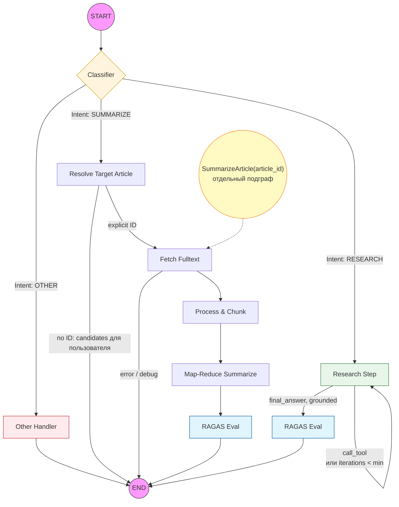
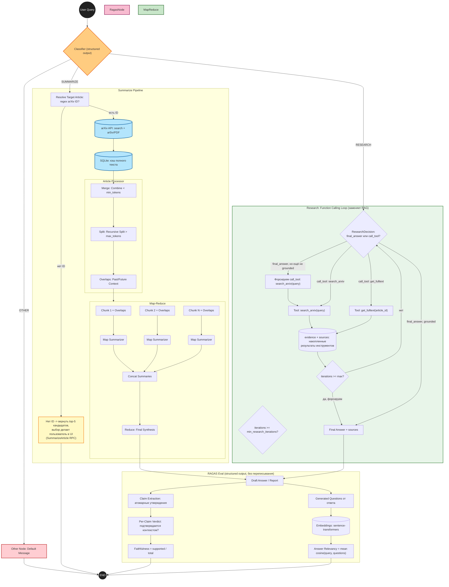

# AI-агент для поиска и суммаризации научных статей (arXiv.org)

Данный репозиторий содержит исходный код системы для анализа научной литературы на базе LLM. Проект автоматизирует цикл работы с ArXiv: от суммаризации отдельной статьи до ответа на исследовательские вопросы через агента с function calling.


## Архитектура системы

Поток управления реализован как граф состояний с помощью **LangGraph**:

1.  **Intent Classifier** (structured output) — определяет цель пользователя:
    *   `summarize`: глубокая суммаризация одной статьи (Map-Reduce);
    *   `research`: вопрос, требующий поиска фактов/статей — обрабатывается агентом с function calling;
    *   `other`: обработка нерелевантных запросов (приветствия, оффтоп).
2.  **Summarize-ветка**: `resolve_target_article` — явный arXiv ID в запросе определяется регуляркой и обрабатывается сразу; если ID нет, узел **не пытается угадать статью сам**, а возвращает top-N кандидатов из поиска — выбор делает пользователь (в Streamlit) или клиент gRPC, вызывая отдельный RPC `SummarizeArticle`. Дальше — `fetch_fulltext` (ar5iv/PDF, с SQLite-кэшем) → `process_and_chunk` (Merge & Split) → `map_reduce_summarize` → `ragas_eval`.
3.  **Research-ветка (function calling вместо RAG)**: цикл `research_step`, ограниченный `max_research_iterations`. На каждом шаге модель через structured output решает: дать финальный ответ прямо сейчас, либо вызвать инструмент — `search_arxiv` (поиск статей по теме) или `get_fulltext` (прочитать конкретную статью). Результат инструмента добавляется в накопленный контекст (`evidence`), и цикл повторяется, пока модель не сочтёт данных достаточно или не будет достигнут лимит итераций. **Grounding-гарантия**: минимум `min_research_iterations` (по умолчанию 1) вызовов инструмента обязательны, прежде чем разрешён финальный ответ — без этого маленькая модель иногда отвечала, ни разу не заглянув в arXiv (вплоть до того, что повторяла сам вопрос как «ответ»). Использованные при этом статьи попадают в `sources` итогового ответа.
4.  **RAGAS-оценка качества** (`ragas_eval`) — вместо прежнего узла критика: измеряет **faithfulness** и **answer relevancy** по методике [RAGAS](https://docs.ragas.io/), не переписывая ответ.

---

## Ключевые технические решения

### 1. Полнотекстовый слой поверх живого arXiv
Раньше текст статьи брался из Postgres; теперь `modules.arxiv_source` + `modules.article_store` тянут его напрямую с arXiv:
*   **Поиск кандидатов** — `export.arxiv.org/api/query` (Atom API, `requests` + stdlib XML, без сторонних пакетов). Если запрос похож на **название** статьи (короткий, не вопрос), сначала делается фразовый поиск по заголовку `ti:"..."` — иначе `all:query` (OR по словам) на запросе вида «attention is all you need» выдаёт шум вместо самой статьи. Клиент соблюдает требование arXiv «не чаще одного запроса в 3 секунды» (`_throttle`) и повторяет запрос при 429/таймауте: без этого единичный сбой API выглядел для агента как «статей по теме не найдено».
*   **Полный текст, порядок попыток**: сначала [ar5iv](https://ar5iv.labs.arxiv.org) (LaTeXML-рендер — секции размечены `<h2>/<h3>`, почти один в один воспроизводит прежнюю структуру `{ЗАГОЛОВОК: текст}`); при неудаче — PDF (PyMuPDF) + regex-эвристика заголовков.
*   **SQLite-кэш** (`data/arxiv_cache.sqlite`) — повторные запросы к одной статье не бьют по сети снова.

### 2. Двухстадийный Article Processor (Merge & Split)
Для решения проблемы лимита контекста и сохранения структуры статьи реализован продвинутый алгоритм подготовки данных:
*   **Stage 1: Token-Aware Merging.** Мелкие подразделы статьи объединяются с соседями, пока не достигнут порога `min_tokens`. Это минимизирует количество вызовов LLM.
*   **Stage 2: Recursive Splitting.** Если после слияния или изначально секция превышает `max_tokens`, она рекурсивно разбивается на части, с сохранением нумерации в заголовках (например, *"Methodology (Part 1)"*).
*   **Stage 3: Custom Overlaps.** К каждому финальному чанку добавляются "теневые" контексты (`past_overlap` и `future_overlap`) из соседних фрагментов, обеспечивая плавность переходов в суммаризации.

### 3. Research-агент с обязательным grounding
Нативные tool-calling API у разных провайдеров несовместимы (у OpenRouter есть OpenAI-совместимый `tools=`, у локального MLX единого стандарта нет) — поэтому function calling реализован провайдер-агностично: `modules.structured_output.generate_structured()` накладывает JSON-инструкцию поверх любого промпта, валидирует ответ Pydantic-схемой (`modules.schemas.ResearchDecision`), при невалидном JSON делает один repair-запрос, а при повторном провале — безопасный дефолт с логированием. Модель решает `action: final_answer | call_tool`, а Python-код лишь диспетчеризирует вызов через `modules.tools.ArxivToolkit`. Если модель пытается ответить раньше, чем сделала `min_research_iterations` вызовов инструмента, решение принудительно подменяется на `call_tool` — это гарантирует, что ответ хоть в какой-то мере опирается на реально найденные данные, а не на "рефлекс" маленькой модели.

Два симметричных случая на границах цикла обрабатываются явно, потому что маленькие модели регулярно в них попадают:
*   `call_tool` **без** имени инструмента или с пустыми аргументами нормализуется в `search_arxiv(query=запрос пользователя)` — иначе итерация сжигалась впустую, а в `evidence` попадал мусор вроде «неизвестный инструмент».
*   Если лимит итераций исчерпан, а модель всё ещё просит инструмент, агент делает один дополнительный вызов, явно сняв инструменты со стола, и просит сформулировать ответ по уже собранным данным. Раньше в этой ветке пользователю отдавалась заглушка «не удалось найти достаточно информации» — даже когда полные тексты статей были успешно скачаны, весь `evidence` просто выбрасывался.

### 4. RAGAS вместо критика
Прежний критик правил отчёт по найденным замечаниям; вместо этого теперь **измеряются**, без переписывания, две метрики по методике RAGAS (`modules/ragas_eval.py`):
*   **Faithfulness** — LLM разбивает ответ на атомарные утверждения, затем для каждого отдельным вызовом проверяет, подтверждается ли оно контекстом (`supported: bool`); итог — доля подтверждённых утверждений.
*   **Answer Relevancy** — LLM генерирует несколько гипотетических вопросов, на которые ответ был бы хорошим ответом (с флагом `noncommittal` для уклончивых ответов); итог — средний косинус между эмбеддингом исходного вопроса и эмбеддингами сгенерированных. Это единственное место в проекте, где снова понадобились эмбеддинги (`sentence-transformers`, маленькая модель) — не для retrieval, а только для этой метрики.

Контекст для faithfulness — исходные чанки статьи (summarize) или содержимое `evidence` (research). Он почти всегда длиннее бюджета одного вызова, поэтому под **каждое** проверяемое утверждение подбираются лексически ближайшие к нему фрагменты контекста, а не просто его начало: иначе для длинной статьи любое утверждение из её второй половины автоматически считалось бы неподтверждённым и faithfulness падал бы тем сильнее, чем длиннее статья. Отбор живёт строго внутри метрики и на ответ пользователю не влияет (в оригинальном RAGAS на этом месте стоят `retrieved_contexts`, которых без ретривера нет).

Вопрос для answer relevancy — запрос пользователя; в summarize-ветке вместо голого ID (`"Summarize arXiv:1706.03762"`) подставляется формулировка по заголовку статьи, так как у ID нет осмысленного эмбеддинга и метрика получалась заниженной независимо от качества обзора.

**Опциональность и LLM-as-a-judge.** Метрики стоят дополнительных LLM-вызовов (разбор ответа на утверждения + проверка каждого), поэтому считаются по запросу: поле `skip_metrics` в `Ask`/`SummarizeArticle`, чекбокс в Streamlit, аргумент `compute_metrics` в `agent.invoke()`/`agent.summarize_article()`; глобально всё это отключается `APP_USE_RAGAS=false`. Судьёй по умолчанию выступает та же модель, что отвечает пользователю, но её можно развести с оцениваемой моделью: `APP_RAGAS_JUDGE_BACKEND=openrouter` + `APP_RAGAS_JUDGE_MODEL=...` поднимет отдельного судью по API.

---

## Отладка и мониторинг (Observability)

### 1. Интроспекция AgentState
Состояние агента (`AgentState`) доступно на каждом шаге:
*   `target_article_id` / `article_chunks` / `debug_data` / `candidates` — для summarize-ветки;
*   `evidence` (результаты вызовов инструментов) / `iterations` / `sources` — для research-ветки;
*   `faithfulness` / `answer_relevancy` — RAGAS-метрики, общие для обеих веток.

### 2. Интеграция с LangSmith
Проект интегрирован с **LangSmith**: визуализация графа, трассировка выполнения, версионирование промптов в Hub с fallback-механизмом на локальный `modules/prompts_local.yaml` (в отличие от прежнего `prompts.yaml`, этот файл коммитится вместе с репозиторием — агент рабочий "из коробки" даже без доступа к Hub).
*   [Промпты](https://smith.langchain.com/hub/fluloeo?organizationId=527befdf-145d-42e4-b03b-bdad31b098c3)

Общие для всех узлов имена (`modules.node_names.NodeName`) и класс `AgentTraceExporter` (`modules/eval.py`) позволяют выгружать трейсы в pandas для офлайн-анализа.

---

## Стек технологий
*   **Ядро:** LangGraph, LangChain.
*   **LLM:** [MLX](https://github.com/ml-explore/mlx) (локальный инференс на Apple Silicon, бэкенд по умолчанию — `Qwen3-4B-Instruct-2507` 4-бит), OpenRouter (облачный, опционально), vLLM (GPU, опционально).
*   **Данные:** живой arXiv API (Atom + ar5iv + PDF), SQLite (локальный кэш).
*   **Оценка качества:** RAGAS-метрики (faithfulness, answer relevancy), `sentence-transformers` только для эмбеддингов answer relevancy.
*   **Backend:** gRPC.
*   **UI:** Streamlit.
*   **Structured output / валидация:** Pydantic.
*   **Мониторинг:** LangSmith.

---

## Запуск проекта

### Настройка секретов и конфигурации
Создайте файл `.env`:
```text
# LangSmith (опционально, для tracing/hub)
LANGSMITH_API_KEY=your_key

# OpenRouter (только если APP_LLM_BACKEND=openrouter)
OPENROUTER_API_KEY=your_key

# Конфигурация приложения (у всех есть разумные дефолты, см. modules/config.py)
APP_LLM_BACKEND=mlx
APP_MLX_MODEL=mlx-community/Qwen3-4B-Instruct-2507-4bit
APP_USE_HUB=false
APP_USE_RAGAS=true
APP_MIN_RESEARCH_ITERATIONS=1
APP_MAX_RESEARCH_ITERATIONS=3
APP_GRPC_HOST=localhost
APP_GRPC_PORT=50051

# LLM-as-a-judge для RAGAS: same (та же модель, дефолт) | openrouter | mlx
APP_RAGAS_JUDGE_BACKEND=same
# APP_RAGAS_JUDGE_MODEL=qwen/qwen3-30b-a3b-instruct-2507
```

**Про выбор модели.** Дефолт — `Qwen3-4B-Instruct-2507-4bit` (~2.5 ГБ). Более крупная `Qwen3-30B-A3B-Instruct-2507-4bit` (~15-17 ГБ) заметно умнее, но на 24 ГБ unified memory под обычной десктопной нагрузкой уводит систему в своп: суммаризация одной статьи растягивалась с секунд до 5-7+ минут. Если памяти больше — `APP_MLX_MODEL` переопределяет дефолт.

### Установка зависимостей
```bash
pip install -r requirements.txt
```

### Запуск gRPC backend
```bash
python -m grpc_service.server
```
Поднимает `ArxivAgent` один раз (через `modules.bootstrap.build_agent`) и обслуживает запросы на `localhost:50051`. Протобаф-стабы уже сгенерированы в `grpc_service/generated/`; при изменении `.proto` перегенерировать: `bash grpc_service/gen_proto.sh`.

### Запуск Streamlit UI
```bash
streamlit run ui/streamlit_app.py
```
Чистый gRPC-клиент — не тянет LangGraph/LLM напрямую, обращается к уже запущенному backend'у. Если `summarize`-запрос не содержит явного arXiv ID, UI покажет top-5 найденных статей на выбор и вызовет `SummarizeArticle` для выбранной; для `research`-ответов показывает блок «Источники» и RAGAS-метрики. Чекбокс «Считать RAGAS-метрики» выключает их для более быстрого ответа.

> **О времени ответа.** Суммаризация статьи целиком — это Map-Reduce по нескольким десяткам чанков, и вызовы к MLX идут последовательно, без батчинга: на локальной модели это минуты, независимо от того, считаются метрики или нет. Клиентские таймауты в UI выставлены соответственно (900 с). Research-ветка заметно быстрее — там 1-3 вызова инструмента и столько же генераций.

> **Стабы protobuf кэшируются процессом.** После правки `.proto` и `bash grpc_service/gen_proto.sh` нужно перезапустить и gRPC-сервер, и Streamlit: Streamlit перезагружает сам `streamlit_app.py`, но уже импортированный `arxiv_agent_pb2` остаётся в памяти старым, и обращение к новому полю падает с `ValueError: Protocol message AskRequest has no "..." field`.

### Программное использование (например, в ноутбуке)
```python
from modules.bootstrap import build_agent
from modules.config import AppConfig

agent = build_agent(AppConfig.from_env())

# Явный ID — суммаризация сразу
result = agent.invoke("Сделай детальный обзор статьи 1706.03762")
print(result["final_answer"], result["faithfulness"], result["answer_relevancy"])

# Без явного ID — вернутся кандидаты, суммаризация отдельным вызовом
result = agent.invoke("Сделай обзор статьи про diffusion models")
chosen_id = result["candidates"][0]["arxiv_id"]
result = agent.summarize_article(chosen_id)

# Research — с гарантированным минимум одним вызовом инструмента
result = agent.invoke("Что известно про dropout как метод регуляризации?")
print(result["final_answer"], result["sources"])

# RAGAS-метрики опциональны: без них ответ заметно быстрее
result = agent.summarize_article("1706.03762", compute_metrics=False)
```

## Граф агента



## Визуализация логики обработки (Детальный граф)


